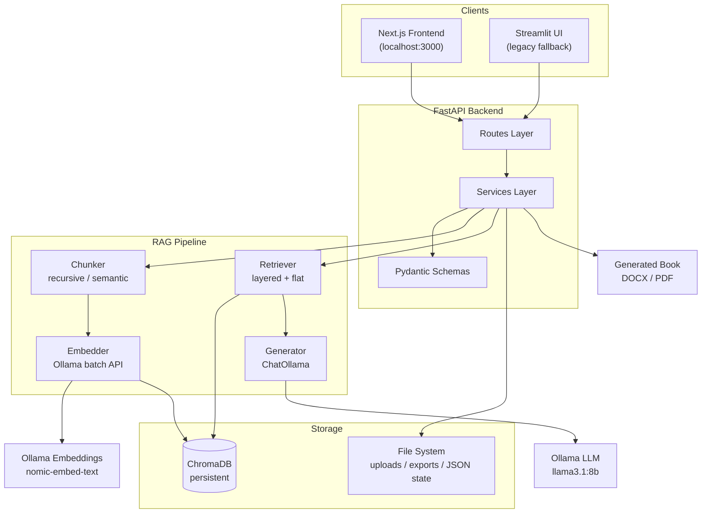
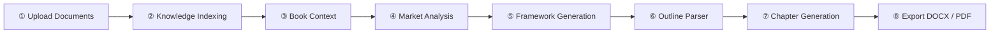

<div align="center">

<!-- Hero Section -->


# BookGen AI


### **Grounded AI book generation powered by Retrieval-Augmented Generation**

Turn your documents, research, and author voice into a structured, citation-backed manuscript — from knowledge ingestion to export-ready DOCX and PDF.

[](https://www.python.org/)
[](https://fastapi.tiangolo.com/)
[](https://www.langchain.com/)
[](https://www.trychroma.com/)
[](https://ollama.com/)
[](https://streamlit.io/)
[](https://nextjs.org/)
[](LICENSE)
[](https://github.com/granth45choubey/RAG_Book_Generator)
[](https://github.com/granth45choubey/RAG_Book_Generator/commits/main)

[Quick Start](#installation) · [API Docs](#api-documentation) · [Architecture](#architecture) · [Contributing](#contributing)

</div>

---

## Demo

| GIF Demo | UI Screenshot | Architecture Diagram |
|:---:|:---:|:---:|
|  |  |  |

> Replace the placeholder images above with real assets in `docs/images/` when available.

---

## Table of Contents

- [Overview](#overview)
- [Features](#features)
- [Architecture](#architecture)
- [Tech Stack](#tech-stack)
- [Project Structure](#project-structure)
- [Workflow](#workflow)
- [Installation](#installation)
- [Environment Variables](#environment-variables)
- [API Documentation](#api-documentation)
- [Screenshots](#screenshots)
- [Example Usage](#example-usage)
- [RAG Pipeline](#rag-pipeline)
- [Project Highlights](#project-highlights)
- [Performance](#performance)
- [Future Improvements](#future-improvements)
- [Contributing](#contributing)
- [License](#license)
- [Author](#author)
- [Acknowledgements](#acknowledgements)
- [Star History](#star-history)

---

## Overview

Writing a non-fiction book with a general-purpose LLM produces fluent prose that often **lacks factual grounding**, **ignores your source material**, and **drifts from your intended audience and structure**. Hallucinated statistics, generic advice, and inconsistent tone are common failure modes.

**BookGen AI** solves this with a production-oriented **Retrieval-Augmented Generation (RAG)** pipeline purpose-built for long-form book creation.

| Challenge | How BookGen AI addresses it |
|---|---|
| LLMs invent facts | Retrieves relevant passages from your uploaded documents and cites sources inline |
| Generic voice | Ingests high-priority **author documents** and injects author guidance into every generation |
| Weak market positioning | Runs **market & competitor analysis** on books, papers, reports, and whitepapers |
| Unstructured output | Builds **book context**, **frameworks**, and **chapter outlines** before generation |
| Disconnected workflow | Provides a guided 8-step workspace (Next.js) plus a full REST API and legacy Streamlit UI |

The system does not replace the author — it **grounds** generation in your knowledge base, competitive landscape, and creative intent so every chapter aligns with your goals.

---

## Features

| Category | Feature | Status | Description |
|:---:|---|:---:|---|
| 📥 | **Knowledge Ingestion** | ✅ | Upload PDF, DOCX, and TXT into a persistent ChromaDB vector store |
| 📥 | **Author Document Upload** | ✅ | High-priority author materials with optional guidance descriptions |
| 📥 | **Document Upload (General)** | ✅ | General knowledge base files with page-level metadata |
| 🧠 | **Book Context Builder** | ✅ | Define title, audience, tone, and reader transformation; optional fields LLM-inferred |
| 📊 | **Market & Competitor Analysis** | ✅ | Async background jobs for books, research papers, industry reports, and whitepapers |
| 🏗️ | **Framework Generation** | ✅ | Generate 3 distinct book frameworks with chapter breakdowns and transformation arcs |
| 📋 | **Outline Parsing** | ✅ | Parse free-form plain text into structured chapters/sections with live preview |
| 🔍 | **Layered Vector Search** | ✅ | Priority-ordered retrieval across author, context, outline, market, and general sources |
| ✍️ | **Chapter Generation** | ✅ | Chapter-by-chapter grounded writing via structured RAG prompts |
| 📄 | **Export to DOCX** | ✅ | Professionally formatted editable Word manuscripts |
| 📕 | **Export to PDF** | ✅ | PDF via DOCX conversion (docx2pdf / Word COM) or ReportLab fallback |
| 🖥️ | **Frontend Dashboard** | ✅ | Next.js 16 workspace with 8-step guided workflow |
| 🔌 | **REST API** | ✅ | FastAPI with OpenAPI docs at `/docs` and `/redoc` |
| 💬 | **Interactive UI (Streamlit)** | ✅ | Legacy full-featured Streamlit interface as fallback |
| 🗄️ | **Persistent ChromaDB** | ✅ | On-disk vector storage survives restarts |
| ⚙️ | **RAG Pipeline** | ✅ | Chunk → embed → retrieve → prompt → generate |
| 🎨 | **Modern UI** | ✅ | Tailwind CSS, shadcn-style components, Framer Motion animations |
| 🌙 | **Dark Theme** | ✅ | Light/dark mode toggle via `next-themes` |
| 📱 | **Responsive Design** | ✅ | Mobile-friendly workspace layout |
| 🔗 | **OpenAI / HuggingFace Embeddings** | 🚧 In Progress | Pluggable embedder architecture; only Ollama is fully wired today |

---

## Architecture

BookGen AI follows a **modular service-layer architecture**: the Next.js frontend and Streamlit UI are thin clients over a FastAPI backend that orchestrates ingestion, layered retrieval, LLM generation, and export.



### Layered Retrieval Priority

When structured book context is available, the query service uses **priority-ordered retrieval**:

1. Author chunks (`source_type=author`)
2. Book context (fixed ChromaDB document)
3. Chapter outline (fixed ChromaDB document)
4. Research paper chunks
5. Industry report chunks
6. Whitepaper chunks
7. Competitor book chunks
8. General knowledge base chunks

---

## Tech Stack

| Layer | Technology | Role |
|---|---|---|
| **Backend** | FastAPI, Uvicorn, Pydantic Settings | REST API, validation, async request handling |
| **Frontend** | Next.js 16, React 19, TypeScript, Tailwind CSS 4 | Primary workspace UI |
| **State (Frontend)** | Zustand, TanStack React Query | Client state and server cache |
| **UI Components** | Radix UI, Framer Motion, Lucide Icons | Accessible, animated interface |
| **Legacy UI** | Streamlit | Full-featured fallback dashboard |
| **Database** | ChromaDB (persistent) | Vector storage with cosine similarity |
| **AI / LLM** | Ollama (`llama3.1:8b`) via LangChain `ChatOllama` | Text generation |
| **Embeddings** | Ollama (`nomic-embed-text`) native `/api/embed` batch API | Document and query embedding |
| **Framework** | LangChain (core, community, ollama) | Prompt chains, output parsing |
| **Document Parsing** | PyMuPDF, python-docx | PDF and DOCX text extraction |
| **Export** | python-docx, ReportLab, docx2pdf, pywin32 | DOCX and PDF manuscript export |
| **Deployment Ready** | Environment-driven config, CORS, health endpoint | Production-oriented defaults |
| **Utilities** | httpx, tenacity, python-dotenv | HTTP client, retries, env loading |

---

## Project Structure

```
RAG_Book_Generator/
├── app/                              # FastAPI backend
│   ├── main.py                       # App entry point, CORS, router registration
│   ├── rag_pipeline/                 # Core RAG modules
│   │   ├── chunker.py                # Recursive & semantic chunking strategies
│   │   ├── embedder.py               # Ollama batch embedding (pluggable providers)
│   │   ├── retriever.py              # ChromaDB storage + layered retrieval
│   │   ├── generator.py              # LLM answer & structured book generation
│   │   ├── market_extractor.py       # Per-document market analysis extraction
│   │   └── competitor_extractor.py   # Legacy competitor extraction helpers
│   ├── services/                     # Business logic orchestration
│   │   ├── document_service.py       # General document ingestion
│   │   ├── author_service.py         # Author document ingestion + guidance
│   │   ├── book_context_service.py   # Book metadata storage & LLM inference
│   │   ├── outline_service.py        # Outline persistence (disk + ChromaDB)
│   │   ├── outline_parser.py         # Plain-text outline → structured JSON
│   │   ├── market_analysis_service.py# Async market analysis jobs + cache
│   │   ├── framework_service.py      # Framework generation, selection, cache
│   │   ├── query_service.py          # RAG query orchestration
│   │   └── export_service.py         # DOCX/PDF export engine
│   ├── routes/                       # FastAPI route handlers
│   │   ├── upload.py                 # POST /upload-documents
│   │   ├── query.py                  # POST /query
│   │   ├── book_context.py           # POST/GET /create-book-context
│   │   ├── author_docs.py            # POST /upload-author-documents
│   │   ├── chapter_outline.py        # Outline CRUD + preview
│   │   ├── framework.py              # Framework generate/select/list
│   │   ├── competitor.py             # Market & legacy competitor analysis
│   │   └── export.py                 # Book save + DOCX/PDF export
│   ├── schemas/                      # Pydantic request/response models
│   │   └── export.py                 # StructuredBook, ExportRequest, etc.
│   └── utils/                        # Shared utilities
│       ├── config.py                 # Central settings (env-driven)
│       ├── file_parser.py            # PDF / DOCX / TXT parsers
│       ├── document_formatter.py     # DOCX manuscript builder
│       └── pdf_formatter.py          # ReportLab PDF fallback
├── frontend/                         # Next.js 16 workspace UI
│   └── src/
│       ├── app/                      # App Router pages
│       │   ├── page.tsx              # Home — create/open projects
│       │   └── (workspace)/          # Guided workflow pages
│       │       ├── documents/        # Knowledge base upload
│       │       ├── author-documents/ # Author materials upload
│       │       ├── book-context/     # Title, audience, tone
│       │       ├── outline/          # Chapter outline editor
│       │       ├── market-analysis/  # Competitor & research analysis
│       │       ├── frameworks/       # Framework generation & selection
│       │       ├── generate/         # Chapter-by-chapter generation
│       │       ├── export/           # DOCX & PDF download
│       │       └── settings/         # API URL & query params
│       ├── components/               # UI, layout, upload components
│       ├── lib/                      # API client, hooks, constants
│       ├── stores/                   # Zustand state stores
│       └── types/                    # TypeScript API types
├── scripts/                          # Profiling utilities
│   ├── profile_ingest.py             # Ingestion stage profiler
│   └── profile_generation.py         # Generation stage profiler
├── author_docs/                      # Author uploads + persisted JSON state
├── competitor_docs/                  # Market analysis source documents + cache
├── uploaded_docs/                    # General knowledge base uploads
├── exports/                          # Generated DOCX/PDF manuscripts
├── streamlit_app.py                  # Legacy Streamlit UI
├── test_api.py                       # Quick API smoke test
├── requirements.txt                  # Python dependencies
├── .env.example                      # Environment variable template
└── README.md
```

### Directory Guide

| Directory | Purpose |
|---|---|
| `app/` | FastAPI backend — routes delegate to services, services call the RAG pipeline |
| `frontend/` | Next.js workspace with an 8-step book creation workflow |
| `scripts/` | Development profiling tools for ingestion and generation |
| `author_docs/` | Author uploads, chapter outline, selected framework, generated book JSON |
| `competitor_docs/` | Market analysis PDFs and `analysis_cache.json` |
| `uploaded_docs/` | General knowledge base files saved on upload |
| `exports/` | Timestamped DOCX and PDF export files |

---

## Workflow

The end-to-end book creation flow:



### Step-by-step

| Step | Action | API / UI |
|:---:|---|---|
| 1 | Upload knowledge base files (PDF, DOCX, TXT) | `POST /upload-documents` · `/documents` |
| 2 | Files are parsed, chunked, embedded, and stored in ChromaDB | Automatic |
| 3 | Upload author materials with optional guidance | `POST /upload-author-documents` · `/author-documents` |
| 4 | Define book title, audience, tone, and transformation goals | `POST /create-book-context` · `/book-context` |
| 5 | Submit competitor books, papers, or reports for async analysis | `POST /analyze-market` · `/market-analysis` |
| 6 | Generate and select one of three book frameworks | `POST /generate-frameworks` · `/frameworks` |
| 7 | Create or paste a chapter outline (plain text → structured) | `POST /set-chapter-outline` · `/outline` |
| 8 | Generate chapters one at a time with grounded RAG | `POST /query` · `/generate` |
| 9 | Export the manuscript as DOCX or PDF | `POST /export/docx` · `/export/pdf` · `/export` |

---

## Installation

### Prerequisites

| Requirement | Version | Notes |
|---|---|---|
| Python | 3.11+ | Backend runtime |
| Node.js | 18+ | Frontend build |
| Ollama | Latest | Local LLM and embedding server |
| Git | Any | Clone the repository |

### 1. Clone the repository

```bash
git clone https://github.com/granth45choubey/RAG_Book_Generator.git
cd RAG_Book_Generator
```

### 2. Create a virtual environment

```powershell
# Windows (PowerShell)
python -m venv .venv
.venv\Scripts\Activate.ps1
```

```bash
# macOS / Linux
python3 -m venv .venv
source .venv/bin/activate
```

### 3. Install Python dependencies

```bash
pip install -r requirements.txt
```

### 4. Install frontend dependencies

```bash
cd frontend
npm install
cd ..
```

### 5. Configure environment (optional)

```bash
cp .env.example .env
# Edit .env with your preferred settings
```

```bash
# Frontend (optional)
cp frontend/.env.example frontend/.env.local
```

### 6. Install and run Ollama

Download from [ollama.com](https://ollama.com/download), then pull required models:

```bash
ollama pull llama3.1:8b
ollama pull nomic-embed-text
```

Verify Ollama is running:

```bash
ollama list
```

### 7. Run the backend

```bash
uvicorn app.main:app --host 0.0.0.0 --port 8000 --reload
```

| Endpoint | URL |
|---|---|
| Swagger UI | http://localhost:8000/docs |
| ReDoc | http://localhost:8000/redoc |
| Health check | http://localhost:8000/health |

### 8. Run the frontend

In a **second terminal**:

```bash
cd frontend
npm run dev
```

Open **http://localhost:3000** for the BookGen AI workspace.

> The frontend connects to `http://localhost:8000` by default. Override via **Settings → Backend API URL** or `NEXT_PUBLIC_API_URL` in `frontend/.env.local`.

### 9. Run Streamlit (optional legacy UI)

In a **third terminal**:

```bash
streamlit run streamlit_app.py
```

> **Note:** Streamlit is not listed in `requirements.txt`. Install it separately if needed: `pip install streamlit`

### Quick smoke test

```bash
python test_api.py
```

---

## Environment Variables

Copy `.env.example` to `.env` to override defaults.

| Variable | Default | Description |
|---|---|---|
| `OLLAMA_BASE_URL` | `http://localhost:11434` | Ollama server URL |
| `OLLAMA_MODEL` | `llama3.1:8b` | LLM model for generation |
| `EMBEDDING_PROVIDER` | `ollama` | Embedding backend (`ollama` only fully implemented) |
| `EMBEDDING_MODEL` | `nomic-embed-text` | Embedding model name |
| `EMBEDDING_BATCH_SIZE` | `64` | Texts per Ollama `/api/embed` batch call |
| `OLLAMA_EMBED_TIMEOUT` | `300` | Embedding HTTP request timeout (seconds) |
| `CHROMA_PERSIST_DIR` | `./chroma_db` | ChromaDB on-disk storage directory |
| `CHROMA_COLLECTION_NAME` | `rag_documents` | Main knowledge base collection name |
| `CHUNK_STRATEGY` | `recursive` | Chunking strategy: `recursive` or `semantic` |
| `CHUNK_SIZE` | `512` | Maximum characters per chunk |
| `CHUNK_OVERLAP` | `64` | Overlap characters between chunks |
| `RETRIEVAL_TOP_K` | `5` | Default chunks retrieved per flat query |
| `UPLOAD_DIR` | `./uploaded_docs` | General document upload directory |
| `AUTHOR_UPLOAD_DIR` | `./author_docs` | Author document upload directory |
| `OUTLINE_STORE_PATH` | `./author_docs/chapter_outline.json` | Persisted chapter outline JSON |
| `GENERATED_BOOK_STORE_PATH` | `./author_docs/generated_book.json` | Persisted structured book JSON |
| `EXPORTS_DIR` | `./exports` | Generated DOCX/PDF output directory |
| `COMPETITOR_COLLECTION_NAME` | `competitor_docs` | Market analysis ChromaDB collection |
| `COMPETITOR_UPLOAD_DIR` | `./competitor_docs` | Market analysis source file directory |
| `MAX_COMPETITOR_BOOKS` | `10` | Hard limit on files per analysis job |
| `AUTHOR_TOP_K` | `3` | Author chunks retrieved in layered search |
| `COMPETITOR_TOP_K` | `2` | Market/competitor chunks per type in layered search |
| `GENERAL_TOP_K` | `3` | General knowledge chunks in layered search |
| `GENERATION_CHUNK_MAX_CHARS` | `320` | Max chars per chunk in LLM prompts |
| `LLM_NUM_PREDICT_FRAMEWORK` | `6144` | Max tokens for framework JSON generation |
| `LLM_NUM_PREDICT_GENERATION` | `2048` | Max tokens for chapter/content generation |
| `FRAMEWORK_CACHE_ENABLED` | `true` | Reuse cached frameworks when inputs are unchanged |

### Frontend

| Variable | Default | Description |
|---|---|---|
| `NEXT_PUBLIC_API_URL` | `http://localhost:8000` | FastAPI backend URL |

---

## API Documentation

Interactive docs: **http://localhost:8000/docs**

### System

| Method | Endpoint | Description | Request | Response |
|:---:|---|---|---|---|
| `GET` | `/health` | Health check with model info | — | `{ status, llm_model, embedding_model, chunk_strategy }` |

### Documents

| Method | Endpoint | Description | Request | Response |
|:---:|---|---|---|---|
| `POST` | `/upload-documents` | Ingest general knowledge base files | `multipart/form-data`: `files[]` (PDF/DOCX/TXT) | `201` — `{ total_files, total_chunks_stored, details[] }` |
| `POST` | `/upload-author-documents` | Ingest high-priority author documents | `multipart/form-data`: `files[]`, optional `description` | `201` — ingestion summary |

### Book Context

| Method | Endpoint | Description | Request | Response |
|:---:|---|---|---|---|
| `POST` | `/create-book-context` | Create or replace active book context | JSON: `{ title*, target_audience*, subtitle?, author_objective?, reader_transformation?, initial_state?, final_state?, tone? }` | `201` — `{ message, context_text, title, ... }` |
| `GET` | `/create-book-context` | Retrieve active book context | — | `{ active: true, ... }` or `{ active: false, message }` |

### Chapter Outline

| Method | Endpoint | Description | Request | Response |
|:---:|---|---|---|---|
| `POST` | `/set-chapter-outline` | Save outline from plain text | JSON: `{ outline_text }` | `201` — `{ chapters_count, chapters, warnings }` |
| `POST` | `/set-chapter-outline/json` | Save outline from structured JSON (legacy) | JSON: `{ chapters: [{ title, sections[] }] }` | `201` — outline summary |
| `POST` | `/set-chapter-outline/preview` | Parse outline without saving | JSON: `{ outline_text }` | `200` — `{ chapters, chapters_count, warnings }` |
| `GET` | `/set-chapter-outline` | Retrieve active outline | — | `200` — outline object or `404` |
| `DELETE` | `/set-chapter-outline` | Delete active outline | — | `200` — confirmation or `404` |

### Market & Research Analysis

| Method | Endpoint | Description | Request | Response |
|:---:|---|---|---|---|
| `POST` | `/analyze-market` | Submit documents for async analysis | `multipart/form-data`: `files[]`; query: `mode` (`replace`\|`merge`), `document_type` (`book`\|`research_paper`\|`industry_report`\|`whitepaper`) | `202` — `{ job_id, status, estimated_duration_minutes, ... }` |
| `GET` | `/analyze-market/status/{job_id}` | Poll job progress | — | Job status object with progress and result |
| `GET` | `/analyze-market/latest` | Get cached analysis result | — | Cached analysis JSON or `404` |

<details>
<summary><strong>Legacy competitor endpoints (backward-compatible)</strong></summary>

| Method | Endpoint | Description |
|:---:|---|---|
| `POST` | `/analyze-competitors` | Same as `/analyze-market` with `document_type=book` |
| `GET` | `/analyze-competitors/status/{job_id}` | Poll job status |
| `GET` | `/analyze-competitors/latest` | Get cached result |

</details>

### Framework Generator

| Method | Endpoint | Description | Request | Response |
|:---:|---|---|---|---|
| `POST` | `/generate-frameworks` | Generate 3 book frameworks | JSON (all optional): `{ book_context?, competitor_analysis?, retrieved_docs?, force_regenerate? }` | `200` — `{ count, frameworks[] }` |
| `POST` | `/select-framework` | Persist selected framework | JSON: `{ framework_id }` | `200` — `{ message, framework }` |
| `GET` | `/frameworks` | List last generated frameworks (session) | — | `200` — `{ count, frameworks[] }` or `404` |
| `GET` | `/selected-framework` | Get persisted selected framework | — | `200` — `{ selected, framework }` or `404` |

### Query / Generation

| Method | Endpoint | Description | Request | Response |
|:---:|---|---|---|---|
| `POST` | `/query` | RAG query with layered or flat retrieval | JSON: `{ question*, top_k?, source_filter? }` | `200` — `{ question, answer, sources[], retrieved_chunks[] }` |

### Export Engine

| Method | Endpoint | Description | Request | Response |
|:---:|---|---|---|---|
| `POST` | `/export/book` | Save structured book JSON | JSON: `{ book: StructuredBook }` | `{ status, chapters_count, stored_at }` |
| `GET` | `/export/book` | Retrieve saved structured book | — | `StructuredBook` or `404` |
| `POST` | `/export/docx` | Export as editable DOCX | JSON (optional): `{ book? }` | `{ status, file_name, download_url }` |
| `POST` | `/export/pdf` | Export as PDF | JSON (optional): `{ book? }` | `{ status, file_name, download_url }` |
| `GET` | `/export/download/{filename}` | Download exported file | — | File stream |

---

## Screenshots

| Home | Framework Generator |
|:---:|:---:|
|  |  |

| Competitor Analysis | Generated Outline |
|:---:|:---:|
|  |  |

| Chapter Generation | Export |
|:---:|:---:|
|  |  |

---

## Example Usage

### End-to-end via API

**Step 1 — Upload a knowledge base document**


```bash
curl -X POST http://localhost:8000/upload-documents \
  -F "files=@research_notes.pdf"
```

**Step 2 — Set book context**


```bash
curl -X POST http://localhost:8000/create-book-context \
  -H "Content-Type: application/json" \
  -d '{
    "title": "Mastering Focus",
    "target_audience": "Knowledge workers struggling with digital distraction",
    "tone": "Practical, empathetic, evidence-based"
  }'
```

**Step 3 — Submit market analysis**


```bash
curl -X POST "http://localhost:8000/analyze-market?mode=replace&document_type=book" \
  -F "files=@competitor_book.pdf"
```

Poll until complete:

```bash
curl http://localhost:8000/analyze-market/status/{job_id}
```

**Step 4 — Generate frameworks and select one**


```bash
curl -X POST http://localhost:8000/generate-frameworks \
  -H "Content-Type: application/json" \
  -d '{}'

curl -X POST http://localhost:8000/select-framework \
  -H "Content-Type: application/json" \
  -d '{"framework_id": "framework_a"}'
```

**Step 5 — Set a chapter outline**


```bash
curl -X POST http://localhost:8000/set-chapter-outline \
  -H "Content-Type: application/json" \
  -d '{"outline_text": "Chapter 1: Why You Can'\''t Focus\n* The myth of laziness\n* Digital distractions"}'
```

**Step 6 — Generate a chapter**


```bash
curl -X POST http://localhost:8000/query \
  -H "Content-Type: application/json" \
  -d '{"question": "Write Chapter 1: Why You Can'\''t Focus. Cover all sections in the outline."}'
```

**Step 7 — Export as DOCX**


```bash
curl -X POST http://localhost:8000/export/docx \
  -H "Content-Type: application/json" \
  -d '{}'
```

### End-to-end via UI

1. Open **http://localhost:3000** and create a new project
2. Follow the 8-step workflow: Documents → Author Docs → Book Context → Outline → Market Analysis → Frameworks → Generate → Export
3. 

---

## RAG Pipeline

### 1. Chunking

Documents are parsed page-by-page (PDF via PyMuPDF, DOCX via python-docx, TXT as a single page), then split using one of two strategies:

| Strategy | Implementation | Best for |
|---|---|---|
| `recursive` | LangChain `RecursiveCharacterTextSplitter` | General purpose, fast |
| `semantic` | Sentence-boundary rolling window | Better coherence per chunk |

Configurable via `CHUNK_SIZE` (default 512) and `CHUNK_OVERLAP` (default 64).

### 2. Embedding

Text chunks are embedded using Ollama's native `/api/embed` endpoint with **batched requests** (`EMBEDDING_BATCH_SIZE=64`). Raw float vectors are passed directly to ChromaDB — no wrapper compatibility issues.

### 3. Retrieval

Two retrieval modes:

- **Flat retrieval** — top-k cosine similarity search (used when no structured context exists, or when `source_filter` is set)
- **Layered retrieval** — priority-ordered fetches across author, book context, outline, market layers, and general knowledge

Chunks carry metadata: `source`, `page`, `chunk_index`, `source_type`, `priority_score`.

### 4. Prompt Construction

The generator builds structured prompts with clearly labeled sections:

- Author guidance and author-provided content (highest priority)
- Selected book framework
- Book context (title, audience, transformation)
- Chapter outline (strict ordering when active)
- Research, industry, whitepaper, and competitor insights
- General retrieved knowledge

Inline source citations: `(Source: <filename>, Page <N>)`.

### 5. Generation

LangChain `ChatOllama` (`llama3.1:8b`, temperature 0.3) produces grounded answers. Three prompt modes:

- Standard RAG Q&A
- Book-context-aware generation
- Structured multi-layer book writing (primary path for chapter generation)

### 6. Export

Structured book JSON (`StructuredBook` schema) is formatted into:

- **DOCX** — professional manuscript via `python-docx`
- **PDF** — via docx2pdf, Windows Word COM, or ReportLab direct fallback

---

## Project Highlights

Aspects that demonstrate production-oriented engineering:

| Highlight | Implementation |
|---|---|
| **Modular architecture** | Separate `routes/`, `services/`, `rag_pipeline/`, and `schemas/` layers |
| **Clean service layer** | Routes are thin; business logic lives in dedicated services |
| **Schema validation** | Pydantic models for all API request/response bodies |
| **REST APIs** | Full FastAPI surface with OpenAPI auto-documentation |
| **Persistent vector DB** | ChromaDB on-disk with two collections (main + market) |
| **Layered retrieval** | Priority-ordered multi-source context assembly |
| **Async job processing** | Background market analysis with status polling |
| **Disk persistence** | Outlines, frameworks, book context, and exports survive restarts |
| **Pluggable backends** | PDF conversion backends (docx2pdf, win32com, ReportLab) |
| **Thread-pool isolation** | CPU/network-bound work offloaded from the async event loop |
| **Production folder structure** | Clear separation of backend, frontend, data, and scripts |

---

## Performance

Implemented optimizations (not aspirational):

| Optimization | Details |
|---|---|
| **Batch embedding** | Ollama native `/api/embed` batches up to 64 texts per HTTP call (~30–40× faster than per-text embedding) |
| **Framework disk cache** | Skips LLM call when inputs fingerprint is unchanged (`FRAMEWORK_CACHE_ENABLED`) |
| **Market analysis cache** | Completed analyses persisted to `competitor_docs/analysis_cache.json` |
| **Persistent ChromaDB** | Vectors stored on disk; no re-indexing on restart |
| **Singleton caching** | `lru_cache` for Chroma client, LLM, embedding HTTP client, and settings |
| **Query vector reuse** | Layered retrieval embeds the query once and reuses the vector across all fetches |
| **Chunk truncation in prompts** | `GENERATION_CHUNK_MAX_CHARS` limits prompt size for faster LLM inference |
| **Thread-pool executors** | Ingestion, query, framework, and market jobs run in dedicated pools |
| **Merge mode** | Market analysis `merge` mode appends without clearing existing data |
| **Profiling scripts** | `scripts/profile_ingest.py` and `scripts/profile_generation.py` for stage timing |

> **Not yet implemented:** LLM response streaming, Redis caching, or incremental re-indexing for general document uploads.

---

## Future Improvements

- [ ] User authentication and authorization
- [ ] Multi-user / multi-project server-side persistence
- [ ] Docker and Docker Compose setup
- [ ] Kubernetes deployment manifests
- [ ] AWS / cloud deployment (ECS, Lambda, S3)
- [ ] CI/CD pipeline (GitHub Actions)
- [ ] Unit and integration test suite
- [ ] Redis cache for framework and query results
- [ ] Multi-agent orchestration (outline agent, editor agent, fact-checker)
- [ ] Streaming LLM generation (SSE / WebSocket)
- [ ] OpenAI and HuggingFace embedding providers (architecture exists, not wired)
- [ ] Observability (structured logging, Prometheus metrics, tracing)
- [ ] Incremental document re-indexing (upsert by file hash)
- [ ] EPUB export format

---

## Contributing

Contributions are welcome. Please follow these guidelines:

1. **Fork** the repository and create a feature branch from `main`
2. **Follow existing conventions** — match naming, service-layer patterns, and Pydantic schema style
3. **Keep changes focused** — one feature or fix per pull request
4. **Test locally** — run the backend (`uvicorn app.main:app --reload`), frontend (`npm run dev`), and `python test_api.py`
5. **Document API changes** — update this README if you add or modify endpoints
6. **Do not commit secrets** — never include `.env`, API keys, or uploaded documents

```bash
# Development workflow
git checkout -b feat/your-feature
# ... make changes ...
python test_api.py
cd frontend && npm run lint
git commit -m "feat: describe your change"
git push origin feat/your-feature
```

Open a pull request with a clear description of what changed and why.

---

## License

This project is licensed under the **MIT License** — see the [LICENSE](LICENSE) file for details.

> **Placeholder:** Add a `LICENSE` file to the repository root if not present.

---

## Author

<div align="center">

**Granth Choubey**

[](https://github.com/granth45choubey)
[](https://www.linkedin.com/in/granthchoubey272003/?skipRedirect=true)
[](https://portfolio-granth-self.vercel.app/)
[](mailto:granthchoubey09@gmail.com)

</div>

---

## Acknowledgements

Built with and inspired by:

- [FastAPI](https://fastapi.tiangolo.com/) — high-performance Python web framework
- [LangChain](https://www.langchain.com/) — LLM orchestration and prompt chains
- [ChromaDB](https://www.trychroma.com/) — open-source embedding database
- [Ollama](https://ollama.com/) — local LLM and embedding inference
- [Next.js](https://nextjs.org/) — React framework for the workspace UI
- [Streamlit](https://streamlit.io/) — rapid prototyping for the legacy UI
- [PyMuPDF](https://pymupdf.readthedocs.io/) — PDF text extraction
- [python-docx](https://python-docx.readthedocs.io/) — DOCX parsing and generation
- [ReportLab](https://www.reportlab.com/) — PDF generation fallback
- [Radix UI](https://www.radix-ui.com/) — accessible component primitives
- [TanStack Query](https://tanstack.com/query) — server state management

---

## Star History

[](https://star-history.com/#granth45choubey/RAG_Book_Generator&Date)

---

<div align="center">

**If BookGen AI helps you write better books, consider giving it a star.**

</div>
